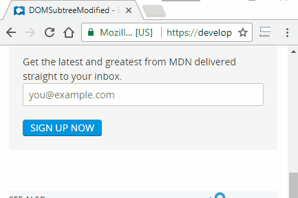

# HTML5 Form validation remover

Simple extension to **remove HTML5 Form constraints**, allowing you to submit any form in webpages even if there is a `required` attribute or other custom HTML5 input type.



This extension adds a `novalidate` attribute on all the forms of the current page, even the ones loaded via AJAX. Additionally, it prevents the browser from showing validation messages and hides validation bubbles via CSS.

The public of this extension is mainly developers wishing to test their backend form validation from a modern browser.

## Download and install from the Chrome Web Store

[](https://chrome.google.com/webstore/detail/html5-form-validation-rem/dcpagcgkpeflhhampddilklcnjdjlmlb)

## Features

- **Manifest V3 Compliant**: Fully compatible with Chrome's Manifest V3 requirements
- **On-demand activation**: Does nothing until you click the icon - respects user privacy
- **Removes HTML5 validation**: Disables browser-native form validation
- **Multiple removal methods**:
  - Adds `novalidate` attribute to all forms
  - Prevents the `invalid` event from showing validation UI
  - Removes validation message elements from the DOM
  - Hides validation bubbles via CSS
- **Configurable**: Enable/disable each removal method via options page
- **Minimal permissions**: Only requests `activeTab`, `scripting`, `storage`, and `notifications`
- **Works on dynamically loaded forms**: MutationObserver handles AJAX-loaded content

## Usage

**The extension does NOTHING by default.** It only activates when you explicitly click the icon.

### Activate on Current Page

1. Navigate to any webpage with HTML5 form validation
2. Click the extension icon in the Chrome toolbar
3. The extension injects the necessary code to remove validation on **that page only**
4. A notification and temporary green checkmark badge confirm activation
5. Try to submit a form with empty required fields - it will submit without validation!

### Configure Options

You can customize which validation removal methods are used:

1. Right-click the extension icon
2. Select "Options"
3. Configure the methods:
   - **Enable extension globally**: Master switch. When disabled, clicking the icon does nothing.
   - **Add novalidate attribute to forms**: Adds `novalidate` to all form elements on the page
   - **Prevent invalid event**: Stops the browser from showing validation popups
   - **Remove validation messages**: Actively removes validation elements from the DOM

### Per-Page Activation

Each time you click the icon, the extension activates on the **current page only**. It does not:
- Run on all pages automatically
- Modify pages you haven't clicked on
- Track your browsing activity
- Require `<all_urls>` permission

## Privacy

This extension is designed with privacy in mind:

- **No persistent content scripts**: Code is injected only when you click the icon
- **No `<all_urls>` permission**: Does not have access to all your web activity
- **No background tracking**: Only uses `activeTab` permission for the current tab
- **On-demand only**: Completely inactive until you explicitly use it
- **No data collection**: Does not send any data to external servers

## Compatibility

- **Chrome**: 88+ (Manifest V3)
- **Firefox**: Supported via browser-specific settings (gecko.id configured)
- **Edge**: Supported (Manifest V3)
- **Brave**: Supported (Manifest V3)

## Migration from Manifest V2

This extension is built on **Manifest V3**, which is required by Chrome starting August 31, 2026. All Manifest V2 extensions will be removed from the Chrome Web Store on that date.

### Key Changes from V2 to V3:

1. **On-demand activation**: Extension now only runs when you click the icon (was persistent in V2)
2. **Service Worker**: Replaces background pages
3. **Declarative APIs**: For network requests (not used in this extension)
4. **Permissions**: More granular permission controls
5. **Remote Code**: Restricted execution of remote code

This extension is fully compliant with Manifest V3 requirements.

## Changelog

### Version 3.0.0 (July 2026)

- **Major refactor**: Migrated from Manifest V2 to Manifest V3
- **Privacy improvement**: On-demand injection instead of persistent content scripts
- **No `<all_urls>` permission**: Extension does nothing without user action
- **Firefox compatibility**: Added `background.scripts` for Firefox support
- **Temporary feedback**: Green checkmark badge appears for 2 seconds on activation
- **Updated icon**: Restored original extension icon

### Version 2.0 (July 2017)

- No more permissions needed! Using `activeTab` instead of `<all_urls>`
- Button is now a toggle specific to the current page
- Forms added asynchronously are also handled

### Version 1 (April 2013)

- Initial release

## Development

### Commands

- `npm run build` - Build the extension to `distribution/` folder
- `npm run lint` - Run linters
- `npm run lint:fix` - Fix linting issues
- `npm test` - Run all linters and build

### Project Structure

```
source/
├── manifest.json          # Extension manifest (V3)
├── background.js          # Service worker (background script)
└── options-storage.js     # Options management

media/
├── logo.png              # Store logo
└── demo.gif              # Demo animation

distribution/             # Built extension files (generated)
```

### Dependencies

- [Parcel 2](https://parceljs.org/) - Bundler
- [webext-options-sync](https://github.com/fregante/webext-options-sync) - Sync options across tabs
- [webext-base-css](https://github.com/fregante/webext-base-css) - Base styles for options page

## How to release

### For Chrome Web Store

1. Build the extension:
   ```bash
   rm -rf distribution/ release/
   npm run build
   ```

2. Create a clean ZIP:
   ```bash
   cd distribution
   zip -r ../html5-form-validation-remover-v3.0.0.zip .
   cd ..
   ```

3. Go to [Chrome Web Store Developer Dashboard](https://chrome.google.com/webstore/developer/dashboard)
4. Select your existing extension (ID: `dcpagcgkpeflhhampddilklcnjdjlmlb`)
5. Upload the ZIP file
6. Fill in the details and submit for review

### For Firefox Add-ons

1. Build the extension:
   ```bash
   npx web-ext build --source-dir=distribution --artifacts-dir=release
   ```

2. Go to [AMO Developer Hub](https://addons.mozilla.org/developers/)
3. Upload the ZIP from `release/`
4. Submit for review

## License

MIT License - see LICENSE file for details.

## Credits

- Original extension by [Damien ALEXANDRE](https://github.com/damienalexandre)
- Updated and maintained for Manifest V3 compatibility
